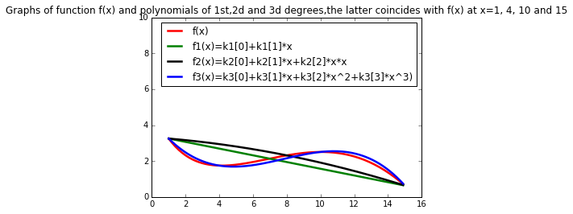

```python
from scipy import linalg
from matplotlib import pylab as plt
import numpy as np
% matplotlib inline 
```


```python
from scipy import optimize
```

#чтобы все графики сразу отображались в ноутбуке

Рассмотрим сложную математическую функцию на отрезке [1, 15]:

f(x) = sin(x / 5) * exp(x / 10) + 5 * exp(-x / 2)


```python

```

Она может описывать, например, зависимость оценок, которые выставляют определенному сорту вина эксперты, в зависимости от возраста этого вина. По сути, задача машинного обучения состоит в том, чтобы приблизить сложную зависимость с помощью функции из определенного семейства. В этом задании мы будем приближать указанную функцию с помощью многочленов.

Как известно, многочлен степени n (то есть w_0 + w_1 x + w_2 x^2 + ... + w_n x^n) однозначно определяется любыми n + 1 различными точками, через которые он проходит. Это значит, что его коэффициенты w_0, ... w_n можно определить из следующей системы линейных уравнений:


где через x_1, ..., x_n, x_{n+1} обозначены точки, через которые проходит многочлен, а через f(x_1), ..., f(x_n), f(x_{n+1}) — значения, которые он должен принимать в этих точках.

Воспользуемся описанным свойством, и будем находить приближение функции многочленом, решая систему линейных уравнений.

1 Сформируйте систему линейных уравнений (то есть задайте матрицу коэффициентов A и свободный вектор b) для многочлена первой степени, который должен совпадать с функцией f в точках 1 и 15. Решите данную систему с помощью функции scipy.linalg.solve. Нарисуйте функцию f и полученный многочлен. Хорошо ли он приближает исходную функцию?


```python
from math import sin,exp,cos
```


```python
from math import sin,exp
def f(x): 
    return np.sin(x[0]/5)*np.exp(x[0] / 10) + 5* np.exp(-x[0] / 2)  
v1=np.array([f([1]),f([4]),f([10]),f([15])])
print('v1',v1)
print ('f([1])',f([1]))
print ('f([8])',f([8]))
print ('f([15])',f([15]))
```

    v1 [ 3.25221687  1.74684595  2.50541641  0.63522142]
    f([1]) 3.25221686527
    f([8]) 2.31617015905
    f([15]) 0.635221419579


```python
a = np.array([[1, 1], [1, 15]])#задача понять что ставить в матрицу А
# Solve the system of equations 1 * k1[0] + 1*k1[1]= f([1]) and 1*k1[0] + 15 * k1[1] = f([15]):
b = np.array([f([1]),f([15])])
k1 = linalg.solve(a, b)
print (k1) #coefficients линейного уравнения, которое в x=1 и x=15 равно значению f([1])  и  f([15]) соответственно
print(a)
print('значения в точках x=1 и x=15-> b:',b)
```

    [ 3.43914511 -0.18692825]
    [[ 1  1]
     [ 1 15]]
    значения в точках x=1 и x=15-> b: [ 3.25221687  0.63522142]


```python
a2 = np.array([[1, 1,1], [1,8,64],[1, 15,225]])#задача понять что ставить в матрицу А

# Solve the system of equations 1 * k2[0] + 1*k2[1]+1*k2[2]= f([1]) and 1*k2[0] + 15 * k2[1]+225*k2[2] = f([15]):
b2 = np.array([f([1]),f([8]),f([15])])
k2 = linalg.solve(a2, b2)
print (k2) #coefficients квадратичного уравнения, которое в x=1,8,15 равно значению f([1]), f([8])и  f([15]) соответственно
print(a2)
print('значения в точках x=1,8,15-> b2:',b2)
```

    [ 3.32512949 -0.06531159 -0.00760104]
    [[  1   1   1]
     [  1   8  64]
     [  1  15 225]]
    значения в точках x=1,8,15-> b2: [ 3.25221687  2.31617016  0.63522142]


```python
a3 = np.array([[1, 1,1,1], [1,4,16,4*16],[1,10,100,1000],[1, 15,225,15*225]])
print(a3)

```

    [[   1    1    1    1]
     [   1    4   16   64]
     [   1   10  100 1000]
     [   1   15  225 3375]]


```python

k3 = linalg.solve(a3, v1) #b3 не заводим, так как уже ранее подсчитали вектор v1-значения функции f в 4 точках
print (k3) #coefficients квадратичного уравнения, которое в x=1,8,15 равно значению f([1]),f([4]),f([8])и  f([15]) соответственно
print(a3)
print('значения в точках x=1,4,10,15-> v1:',v1)
```

    [ 4.36264154 -1.29552587  0.19333685 -0.00823565]
    [[   1    1    1    1]
     [   1    4   16   64]
     [   1   10  100 1000]
     [   1   15  225 3375]]
    значения в точках x=1,4,10,15-> v1: [ 3.25221687  1.74684595  2.50541641  0.63522142]


```python
f1=k1[0]+k1[1]*x # линейное уравнение
f2=k2[0]+k2[1]*x+k2[2]*x*x  # уравнение многочлена второй степени, который совпадает с функцией f в точках 1, 8 и 15.
f3=k3[0]+k3[1]*x+k3[2]*x*x+k3[3]*x*x*x

```


```python
np.allclose(np.dot(a,k1),b)
np.allclose(np.dot(a2,k2),b2) # проверка что коэффициенты найдены правильно
np.allclose(np.dot(a3,k3),v1)

```


    True


```python
%matplotlib inline
import matplotlib.pyplot as plt
```


```python
x = np.arange(1.,15.,0.1)
f = np.sin(x/5)*np.exp(x/10)+ 5* np.exp(-x / 2) #важно здесь использовать np.exp, а не math.exp как некоторые

plt.plot(x, f, color="red",  linewidth=2.5, linestyle="-", label="f(x)")
plt.plot(x, f1, color="green",  linewidth=2.5, linestyle="-", label="f1(x)=k1[0]+k1[1]*x")
plt.plot(x, f2, color="black",  linewidth=2.5, linestyle="-", label="f2(x)=k2[0]+k2[1]*x+k2[2]*x*x")
plt.plot(x, f3, color="blue",  linewidth=2.5, linestyle="-", label="f3(x)=k3[0]+k3[1]*x+k3[2]*x^2+k3[3]*x^3)")
plt.legend(loc='upper right')

plt.title('Graphs of function f(x) and polynomials of 1st,2d and 3d degrees,the latter coincides with f(x) at x=1, 4, 10 and 15')
plt.xlim(0.0, 16.0)

plt.ylim(0.0,10)
plt.show()
```





2 Повторите те же шаги для многочлена второй степени, который совпадает с функцией f в точках 1, 8 и 15. Улучшилось ли качество аппроксимации


3 Повторите те же шаги для многочлена третьей степени, который совпадает с функцией f в точках 1, 4, 10 и 15. Хорошо ли он аппроксимирует функцию? Коэффициенты данного многочлена (четыре числа в следующем порядке: w_0, w_1, w_2, w_3) являются ответом на задачу. Округлять коэффициенты не обязательно, но при желании можете произвести округление до второго знака (т.е. до числа вида 0.42)
I know polynomial interpolation, which is for finding a polynomial of degree n given n+1 data points


```python
print (k3) #coefficients квадратичного уравнения, которое в x=1,4,10,15 равно значению f([1]),f([4]),f([10])и  f([15]) соответственно
```

    [ 4.36264154 -1.29552587  0.19333685 -0.00823565]


```python
print(k3[0],k3[1],k3[2],k3[3])
```

    4.36264153512 -1.29552586569 0.193336847022 -0.00823565117332


```python
print(round (k3[0],2),round(k3[1],2),round(k3[2],2),round(k3[3],2))
```

    4.36 -1.3 0.19 -0.01


```python
round(1.456,2)
```


    1.46


```python
z=4.41-1.36*(1)+0.21*(1)*(1)-0.01*(1)*(1)*(1)
z4=4.41-1.36*(4)+0.21*(4)*4-0.01*(4)*(4)*(4)
z8=4.41-1.36*(8)+0.21*(8)*8-0.01*(8)*(8)*(8)
z8_exact=k3[0]+k3[1]*(8)+k3[2]*(8)*(8)+k3[3]*(8)*(8)*(8)
z15=k3[1]
```


```python
print(z,z4,z8,z8_exact)
```

    3.25 1.6899999999999995 1.8499999999999988 2.1553394182


```python
print(f[15],f1[15],f2[15],f3[15])
print(f[1],f1[1],f2[1],f3[1])
```

    2.04811856128 2.97182449609 3.11434401776 2.20350011518
    3.12835399447 3.23352404066 3.24408948787 3.16053901604


```python

```


```python

```
