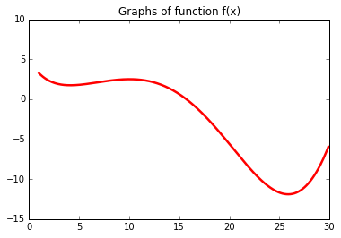
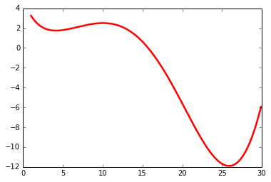

```python
from scipy import linalg
from matplotlib import pylab as plt
import numpy as np
% matplotlib inline 
```


```python
from scipy import optimize
from scipy.optimize import minimize
```

# Part 1

Рассмотрим сложную математическую функцию на отрезке [1, 30]:

f(x) = sin(x / 5) * exp(x / 10) + 5 * exp(-x / 2)

2. В первом задании будем искать минимум этой функции на заданном промежутке с помощью scipy.optimize. 

4. Изучите примеры использования scipy.optimize.minimize в документации Scipy (см. "Материалы")
5. Попробуйте найти минимум, используя стандартные параметры в функции scipy.optimize.minimize (т.е. задав только функцию и начальное приближение). Попробуйте менять начальное приближение и изучить, меняется ли результат.
Укажите в scipy.optimize.minimize в качестве метода BFGS (один из самых точных в большинстве случаев градиентных методов оптимизации), запустите из начального приближения x=2. Градиент функции при этом указывать не нужно – он будет оценен численно. Полученное значение функции в точке минимума - ваш первый ответ по заданию 1, его надо записать с точностью до 2 знака после запятой.
Теперь измените начальное приближение на x=30. Значение функции в точке минимума - ваш второй ответ по заданию 1, его надо записать через пробел после первого, с точностью до 2 знака после запятой.
Стоит обдумать полученный результат. Почему ответ отличается в зависимости от начального приближения? Если нарисовать график функции (например, как это делалось в видео, где мы знакомились с Numpy, Scipy и Matplotlib), можно увидеть, в какие именно минимумы мы попали. В самом деле, градиентные методы обычно не решают задачу глобальной оптимизации, поэтому результаты работы ожидаемые и вполне корректные.


```python
from math import sin,exp
```


```python
from math import sin,exp
def f(x): 
    return np.sin(x[0]/5)*np.exp(x[0] / 10) + 5* np.exp(-x[0] / 2)  

```


```python
print ('f([1])',f([1]))
```

    f([1]) 3.25221686527


```python
def h(x):
    return int(np.sin(x[0]/5)*np.exp(x[0] / 10) + 5* np.exp(-x[0] / 2))
```


```python
print ('h([1])',h([1]))

```

    h([1]) 3


```python
x_min=optimize.minimize(f,[1,30])
print(x_min)
```

          fun: 1.7452682903321932
     hess_inv: array([[ 6.01546361,  0.        ],
           [ 0.        ,  1.        ]])
          jac: array([ -2.68220901e-07,   0.00000000e+00])
      message: 'Optimization terminated successfully.'
         nfev: 32
          nit: 7
         njev: 8
       status: 0
      success: True
            x: array([  4.13628706,  30.        ])


```python
x_min_BFGS_2=optimize.minimize(f,2.0,method='BFGS' )
print(x_min_BFGS_2)
```

          fun: 1.745268290344928
     hess_inv: array([[ 5.98750711]])
          jac: array([ -2.05636024e-06])
      message: 'Optimization terminated successfully.'
         nfev: 21
          nit: 6
         njev: 7
       status: 0
      success: True
            x: array([ 4.13627619])


```python
x_min_BFGS_30=optimize.minimize(f,30.0,method='BFGS' )
print(x_min_BFGS_30)
```

          fun: -11.898894665981322
     hess_inv: array([[ 1.67940841]])
          jac: array([ 0.])
      message: 'Optimization terminated successfully.'
         nfev: 21
          nit: 6
         njev: 7
       status: 0
      success: True
            x: array([ 25.880193])


```python
%matplotlib inline
import matplotlib.pyplot as plt
```


```python
x = np.arange(1.,30.,0.1)
f = np.sin(x/5)*np.exp(x/10)+ 5* np.exp(-x / 2) #важно здесь использовать np.exp, а не math.exp как некоторые

plt.plot(x, f, color="red",  linewidth=2.5, linestyle="-", label="f(x)")
#plt.plot(x, h, color="green",  linewidth=2.5, linestyle="-", label="h(x)")
plt.title('Graphs of function f(x)' )
plt.xlim(0.0, 30.0)

plt.ylim(-15.0,10,1)
plt.show()
```





Ответ 1.74 -11.89 
У функции f(x) на отрезке [1, 30] есть два минимума. Взяв начальное приближение x=2 мы попадаем в первый, а начав с точки x=30 – во вт

# Part 2

1. Теперь попробуем применить к той же функции f(x) метод глобальной оптимизации — дифференциальную эволюцию.
2. Изучите документацию и примеры использования функции scipy.optimize.differential_evolution.
3. Обратите внимание, что границы значений аргументов функции представляют собой список кортежей (list, в который помещены объекты типа tuple). Даже если у вас функция одного аргумента, возьмите границы его значений в квадратные скобки, чтобы передавать в этом параметре список из одного кортежа, т.к. в реализации scipy.optimize.differential_evolution длина этого списка используется чтобы определить количество аргументов функции.
4. Запустите поиск минимума функции f(x) с помощью дифференциальной эволюции на промежутке [1, 30]. Полученное значение функции в точке минимума - ответ в задаче 2. Запишите его с точностью до второго знака после запятой. В этой задаче ответ - только одно число.

Заметьте, дифференциальная эволюция справилась с задачей поиска глобального минимума на отрезке, т.к. по своему устройству она предполагает борьбу с попаданием в локальные минимумы.
Сравните количество итераций, потребовавшихся BFGS для нахождения минимума при хорошем начальном приближении, с количеством итераций, потребовавшихся дифференциальной эволюции. При повторных запусках дифференциальной эволюции количество итераций будет меняться, но в этом примере, скорее всего, оно всегда будет сравнимым с количеством итераций BFGS. Однако в дифференциальной эволюции за одну итерацию требуется выполнить гораздо больше действий, чем в BFGS. Например, можно обратить внимание на количество вычислений значения функции (nfev) и увидеть, что у BFGS оно значительно меньше. Кроме того, время работы дифференциальной эволюции очень быстро растет с увеличением числа аргументов функции.


```python
from scipy.optimize import  differential_evolution
import numpy as np
```


```python
x_min_dif_evol_f=optimize.differential_evolution(f,[(1,30)])
print(x_min_dif_evol_f)
```


    ---------------------------------------------------------------------------

    TypeError                                 Traceback (most recent call last)

    <ipython-input-298-26e00345e928> in <module>()
    ----> 1 x_min_dif_evol_f=optimize.differential_evolution(f,[(1,30)])
          2 print(x_min_dif_evol_f)


    //anaconda/lib/python3.5/site-packages/scipy/optimize/_differentialevolution.py in differential_evolution(func, bounds, args, strategy, maxiter, popsize, tol, mutation, recombination, seed, callback, disp, polish, init)
        204                                          disp=disp,
        205                                          init=init)
    --> 206     return solver.solve()
        207 
        208 


    //anaconda/lib/python3.5/site-packages/scipy/optimize/_differentialevolution.py in solve(self)
        495         # initial energies to be calculated (the following loop isn't run).
        496         if np.all(np.isinf(self.population_energies)):
    --> 497             self._calculate_population_energies()
        498 
        499         # do the optimisation.


    //anaconda/lib/python3.5/site-packages/scipy/optimize/_differentialevolution.py in _calculate_population_energies(self)
        572             parameters = self._scale_parameters(candidate)
        573             self.population_energies[index] = self.func(parameters,
    --> 574                                                         *self.args)
        575             self._nfev += 1
        576 


    TypeError: 'numpy.ndarray' object is not callable


"""Finds the global minimum of a multivariate function.
    Differential Evolution is stochastic in nature (does not use gradient
    methods) to find the minimium, and can search large areas of candidate
    space, but often requires larger numbers of function evaluations than
    conventional gradient based techniques.

# Part 3

Задача 3. Минимизация негладкой функции

Теперь рассмотрим функцию h(x) = int(f(x)) на том же отрезке [1, 30], т.е. теперь каждое значение f(x) приводится к типу int и функция принимает только целые значения.
Такая функция будет негладкой и даже разрывной, а ее график будет иметь ступенчатый вид. Убедитесь в этом, построив график h(x) с помощью matplotlib.
Попробуйте найти минимум функции h(x) с помощью BFGS, взяв в качестве начального приближения x=30. Получившееся значение функции – ваш первый ответ в этой задаче.
Теперь попробуйте найти минимум h(x) на отрезке [1, 30] с помощью дифференциальной эволюции. Значение функции h(x) в точке минимума – это ваш второй ответ в этом задании. Запишите его через пробел после предыдущего.
Обратите внимание на то, что полученные ответы различаются. Это ожидаемый результат, ведь BFGS использует градиент (в одномерном случае – производную) и явно не пригоден для минимизации рассмотренной нами разрывной функции. Попробуйте понять, почему минимум, найденный BFGS, именно такой (возможно в этом вам поможет выбор разных начальных приближений).
Выполнив это задание, вы увидели на практике, чем поиск минимума функции отличается от глобальной оптимизации, и когда может быть полезно применить вместо градиентного метода оптимизации метод, не использующий градиент. Кроме того, вы попрактиковались в использовании библиотеки SciPy для решения оптимизационных задач, и теперь знаете, насколько это просто и удобно.


```python
x = np.arange(1.,30.,0.1)
 #важно здесь использовать np.exp, а не math.exp как некоторые

plt.plot(x, f, color="red",  linewidth=2.5, linestyle="-", label="h(x)")
plt.plot(x, h, color="green",  linewidth=2.5, linestyle="-", label="h(x)")
plt.title('Graphs of function f(x)' )
plt.xlim(0.0, 30.0)

plt.ylim(-15.0,10,1)
plt.show()
```


    ---------------------------------------------------------------------------

    ValueError                                Traceback (most recent call last)

    <ipython-input-299-44f4d9d251d7> in <module>()
          3 
          4 plt.plot(x, f, color="red",  linewidth=2.5, linestyle="-", label="h(x)")
    ----> 5 plt.plot(x, h, color="green",  linewidth=2.5, linestyle="-", label="h(x)")
          6 plt.title('Graphs of function f(x)' )
          7 plt.xlim(0.0, 30.0)


    //anaconda/lib/python3.5/site-packages/matplotlib/pyplot.py in plot(*args, **kwargs)
       3159         ax.hold(hold)
       3160     try:
    -> 3161         ret = ax.plot(*args, **kwargs)
       3162     finally:
       3163         ax.hold(washold)


    //anaconda/lib/python3.5/site-packages/matplotlib/__init__.py in inner(ax, *args, **kwargs)
       1817                     warnings.warn(msg % (label_namer, func.__name__),
       1818                                   RuntimeWarning, stacklevel=2)
    -> 1819             return func(ax, *args, **kwargs)
       1820         pre_doc = inner.__doc__
       1821         if pre_doc is None:


    //anaconda/lib/python3.5/site-packages/matplotlib/axes/_axes.py in plot(self, *args, **kwargs)
       1380         kwargs = cbook.normalize_kwargs(kwargs, _alias_map)
       1381 
    -> 1382         for line in self._get_lines(*args, **kwargs):
       1383             self.add_line(line)
       1384             lines.append(line)


    //anaconda/lib/python3.5/site-packages/matplotlib/axes/_base.py in _grab_next_args(self, *args, **kwargs)
        379                 return
        380             if len(remaining) <= 3:
    --> 381                 for seg in self._plot_args(remaining, kwargs):
        382                     yield seg
        383                 return


    //anaconda/lib/python3.5/site-packages/matplotlib/axes/_base.py in _plot_args(self, tup, kwargs)
        357             x, y = index_of(tup[-1])
        358 
    --> 359         x, y = self._xy_from_xy(x, y)
        360 
        361         if self.command == 'plot':


    //anaconda/lib/python3.5/site-packages/matplotlib/axes/_base.py in _xy_from_xy(self, x, y)
        217         y = _check_1d(y)
        218         if x.shape[0] != y.shape[0]:
    --> 219             raise ValueError("x and y must have same first dimension")
        220         if x.ndim > 2 or y.ndim > 2:
        221             raise ValueError("x and y can be no greater than 2-D")


    ValueError: x and y must have same first dimension





```python
print ('h([1])',h([1]))
print ('h([15])',h([15]))
```

    h([1]) 3
    h([15]) 0


```python
x_min_BFGS_30_h=optimize.minimize(h,30.0,method='BFGS' )#найти минимум функции h(x) с помощью BFGS, взяв в качестве начального приближения x=30. Получившееся значение функции – ваш первый ответ в этой задаче.
print(x_min_BFGS_30_h)
```

          fun: -5
     hess_inv: array([[1]])
          jac: array([ 0.])
      message: 'Optimization terminated successfully.'
         nfev: 3
          nit: 0
         njev: 1
       status: 0
      success: True
            x: array([ 30.])


```python
x_min_h_dif_evol=optimize.differential_evolution(h,[(1,30)])
print(x_min_h_dif_evol)
```

         fun: -11.0
     message: 'Optimization terminated successfully.'
        nfev: 92
         nit: 5
     success: True
           x: array([ 25.67237855])


```python

```


```python

```


```python

```
